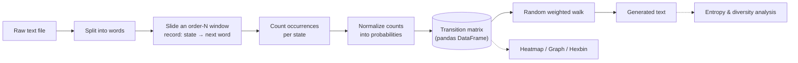

# 🔗 Markov Chain Text Generator

<div align="center">


[](https://git.io/typing-svg)


</div>

---

## 📖 What is this?

A from-scratch **Markov chain text generator**, built as the practical/coding half of a *Facharbeit* (extended German high-school research paper) on how Markov chains can be used to generate natural-sounding text.

Feed it any plain-text file, and it will:

1. Learn how often each word (or sequence of `order` words) is followed by which next word.
2. Turn that into a transition **probability matrix**.
3. Walk the matrix randomly, weighted by probability, to generate brand-new text in the same "style" as the source.
4. Score the result with entropy/diversity metrics so you can compare different orders and corpora objectively.

> [!NOTE]
> This is not a neural network yet. It is rather the classical, fully-transparent statistical approach: every generated word can be traced back to a probability in a table you can literally look at.

---

## ✨ Features

- 🧠 **Configurable order** — order-1 ("given one word") up to order-*n* chains, trading off variety vs. coherence.
- 📊 **Three visualizations** out of the box: transition **heatmap**, directed **state graph**, and a **hexbin** density plot for large matrices.
- 📈 **Built-in text analytics** — lexical diversity, word/character Shannon entropy, and bigram entropy, so generated output can be scored, not just eyeballed.
- 🔁 **Graceful dead-end handling** — if generation walks into a state with no known successor, it jumps to a random state instead of crashing or stalling.
- 🗂️ **Multiple sample corpora included** — German news sentences, *Eugene Onegin*, Wikipedia sentences, and small/large synthetic samples — ready to train on immediately.

---

## ⚙️ How it works



For `order = 1`, a state is a single word (`"the"`); for `order = 2`, a state is a pair (`"the", "cat"`). At every step, the generator looks up the current state's row in the transition matrix and rolls a weighted die over the possible next states.

---

## 🚀 Getting started

### Install dependencies

```bash
pip install pandas matplotlib seaborn networkx
```

### Train and generate

```python
from markov import MarkovChain

# order=2 looks two words back before choosing the next one
chain = MarkovChain(order=2, show_heatmap=True, show_graph=True, show_hexbin=False)

chain.train("sample_text_large.txt")

text = chain.generate(length=200)
print(text)

chain.analyze(text)
```

Running [markov.py](markov.py) directly does exactly this end-to-end (training, generating, and analyzing) against `your_text_file.txt` — swap in any of the included corpora, or your own.

---

## 📉 Example analysis output

`analyze()` prints (and returns as a dict) a quick statistical fingerprint of any generated text:

```
--- Text Statistics (Order 1) ---
Total words:       200
Unique words:      142
Lexical diversity: 0.7100
Word entropy:      6.8123 bits
Char entropy:      4.1725 bits
Bigram entropy:    7.4590 bits
```

| Metric | What it tells you |
|---|---|
| **Lexical diversity** | Share of unique words — closer to `1.0` means richer vocabulary, closer to `0` means repetitive output |
| **Word entropy** | How unpredictable word choice is (bits) — higher = more varied |
| **Char entropy** | Same idea at the character level |
| **Bigram entropy** | Unpredictability of consecutive word *pairs* — catches looping phrases that word entropy alone misses |

These metrics were used to compare order-1 vs. order-2 chains across Grammar, Coherence, Local Semantics, and Naturalness — see `analyze_everything.py` and the `analytics/` folder for the full comparison charts.

---

## 🔬 Background

This started as the coding component of a *Facharbeit* investigating whether simple Markov chains can produce plausible natural-language text, and how generation quality changes with chain order and corpus choice. 

---

<div align="center">


</div>
